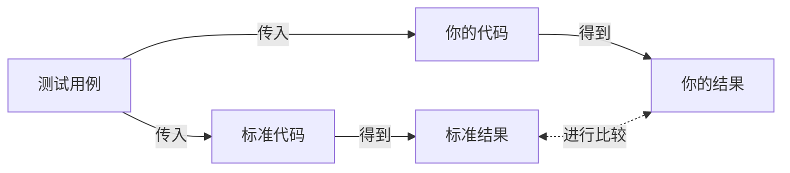

[toc]

# Leetcode 算法学习

------

## Day 0

### 一、数据范围反推时间复杂度

**程序运行时间**与数据量大小与算法好坏有关，是算法性能好坏的一种评估方式，一般采用大O表示法：O(*)

不同的时间复杂度关系如下，横坐标为元素个数，纵坐标为操作次数。


#### 常见的操作与时间复杂度


#### 数组相关操作以及其时间复杂度

- 规定 n = len(arr)，即n是数组的长度

  - 增删：

    - 在数组结尾添加或删除元素：O(1)

    - 在任意索引中添加或删除元素：O(n)

      > 因为数组在内存空间中是连续排布的，当增删位置在中间时，其他受影响的元素也要依次移

  - 改：访问或修改任意索引处的元素：O(1)

  - 查：检查元素是否存在：O(n)

    > 需要依次遍历

#### 链表相关操作以及其时间复杂度

- 规定 n 为链表中的节点数

  - 增删：
    - 在*给定*节点结尾添加或删除元素：O(1)
    - 如果是双向链表，*给定指针*位置添加或删除元素：O(1)
    - 在*没有指针*的任意位置添加或删除元素：O(n)

  - 改查：*无指针*任意位置的访问元素或检查元素是否存在: O(n)

#### 哈希表/哈希集合相关操作以及其时间复杂度

-  规定 n 为哈希表的长度，n = len(hash_table)
  - 增删：添加或删除键值对 key-value pair : O(1)
  - 改：访问或修改与 key 相关的值: O(1)
  - 查：检查键 key 是否存在: O(1)
  - 遍历：遍历所有键值对 key-value pair : O(n)
- 规定 n 为哈希集合的长度，n = len(hash_set)
  - 增删：添加或删除元素: O(1)
  - 改查：检测元素是否存在: O(1)

#### 栈相关操作以及其时间复杂度

- 规定 n = len(stack)，即n是栈的长度
  - 增：在栈顶加入元素: O(1)
  - 删：在栈顶删除元素: O(1)
  - 改：访问或修改任意索引处的元素: O(1)
  - 查：
    - 查看栈顶元素: O(1)
    - 检测元素是否存在: O(n)

#### 队列相关操作以及其时间复杂度

- 规定 n = len(queue)，即n是队列的长度
  - 增：在队尾加入元素: O(1)
  - 删：在队头删除元素: O(1)
  - 改：访问或修改任意索引处的元素: O(1)
  - 查：
    - 查看队头元素: O(1)
    - 检测元素是否存在: O(n)

#### 排序算法的时间复杂度


#### 常见算法的时间复杂度

规定 n 是数组的长度/树或图的节点数

| 算法名称          | 时间复杂度 | 算法名称     | 时间复杂度     |
| ----------------- | ---------- | ------------ | -------------- |
| 二分查找          | O(logn)    | 查找前缀和   | O(1)           |
| 双指针 / 滑动窗口 | O(n)       | 一维动态规划 | O(n)           |
| DFS / BFS         | O(n)       | 二维动态规划 | O(n^2)         |
| 构建前缀和        | O(n)       | 回溯         | O(2^n) / O(n!) |

#### 数据范围反推时间复杂度

考试时，题目一般会有时间限制，如1s/2s等等，这里是时间限制，指的是单个用例的运行时间，编译型语言如C/C++的要求可能会更高。

解题思路：**数据范围 👉 时间复杂度 👉 算法**

题目一般会给定数据范围，如 n <= 10^5 等等，根据题目所给定的数据范围，反推时间复杂度，进而反推算法。

##### 数据范围：n ~ 100

- O(n!) /O(2^n) 的时间复杂度

- 应该考虑回溯或任何蛮力式的递归、暴力枚举算法

  

##### 数据范围：n ~ 1000

- O(n^2) 的时间复杂度
- 通常涉及双重循环，内层循环可能涉及双指针、dp等等


##### 数据范围：n ~ 100,000

- O(logn)(二分) / O(n)(线性查找/线性遍历) / O(nlogn) (贪心/双指针，先排序再遍历)的时间复杂度
- 双重循环无法通过，但可以接受直接遍历，很多贪心/双指针的问题


##### 数据范围：n ~ 1000,000

- O(1) / O(logn) 的时间复杂度
- 涉及二分查找或者数学解法


> 一些题目被标记为简单，可能因为数据范围太小，可以用复杂度较差的解法完成，在笔试/面试时，如果想不到最优做法，也可以用暴力做法先获得部分分数。

### 二、ACM模式与核心代码模式袪魅

OJ系统：在线判题系统：OJ (Online Judge) System，如LeetCode、LintCode、HackerRank、牛客、洛谷、欧弟OJ等等。

OJ系统判断正确与否与给分标准：

- 单个测试用例的判题流程



- 总得分 = 正确用例数 / 总用例数 * 100

**什么是ACM模式？**

自己构造**输入数据格式**，OJ界面不会提供任何代码，包括include/import**库或函数**都要自己完成，最后要自己控制**输出数据的格式**

详细的写法见`ACM输入输出模式总结`文档。

**LeetCode核心代码模式的Solution类**

LeetCode习题通常会给定一个叫Solution的类，并要求我们编写一个类
内的方法作为解题函数。比如：

```python
class Solution:
	def sum(self, num1: int, num2: int) -> int:
		return num1 + num2
```

我们在做LeetCode习题时，通常不需要我们自己去写输入语句，这是因为LeetCode后端已经为我们写好了若干个测试实例并调用了我们的方法。

```
sol = Solution()		# 一种可能的测试写法
print(sol.sum(1, 2))	# sol是Solution的一个实例对象
print(sol.sum(3, 4))	# sol.twoSum调用了我们所补充的方法
```

**ACM模式与核心代码模式区别总结**

|          | 核心代码模式                                                 | ACM模式                                                      |
| :------- | :----------------------------------------------------------- | :----------------------------------------------------------- |
| 出现场景 | LeetCode、HackerRank                                         | 牛客，大厂/OD笔试，[欧弟OJ](https://oj.algomooc.com/)，自己的IDE |
| 输入     | 1.用**函数传参**的方式传入参数<br />2.传入的变量一般无需再做数据类型的转换 | 1.用`input()`的方式输入参数<br />2.需要用`split()`或`map()`等函数**得到合适的数据类型** |
| 输出     | 1.使用`return`返回答案<br />2.在代码中**任意位置**均可以`return` | 1.使用`print()`输出答案<br />2.在代码**最后**进行`print()`   |

**启示**

- 不管是ACM模式还是核心代码模式，解题**核心在于算法逻辑而不是输入输出的格式**，不要过分纠结
- 考试没有过程分，只有最终的答案分。**输出格式和题目保持一致非常重要**
- 每道题的分数是按照**用例通过百分比**来计算的，一定要在有限的时间内多拿分，**即使用较差的算法**
- 如果某些题目的输出只有有限的可能，如True/False，1/0/-1，如果不会写的话可以**直接输出其中某种结果**，拿到部分分数

### 三、从晦涩题干中阅读理解抓住核心考点


**设问类型**

1. **题干一致，设问一致**

   

   

2. **题干一致，设问修改**
   	

   

3. **题干修改，设问类似**
   

   

4. **无类似原题，题干易懂**
   
   
   
5. **无类似原题，题干晦涩**
   - 技巧1：如有图片示例，优先从**图片**着手进行理解
   
   - 技巧2：排除无关信息，**抓住主干**问题
   
   - 技巧3：根据用例说明，反推题目意思
   
     
   
7. **总结**
